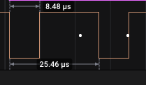
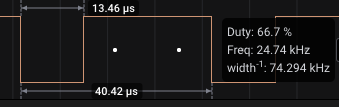

# Cyberapocalyse

Post CTF solving and analysis...

## Pwn

## Controller

**Challenge Info**: The extraterrestrials have a special controller in order to manage and use our resources wisely, in order to produce state of the art technology gadgets and weapons for them. If we gain access to the controller's server, we can make them drain the minimum amount of resources or even stop them completeley. Take action fast!

ROP stuff...

```c
undefined8 main(void)

{
  setvbuf(stdout,(char *)0x0,2,0);
  welcome();
  calculator();
  return 0;
}
```
The third argument is the mode which is set to line buffering (On Input, the buffer is filled till the next newline character when an input operation is requested and buffer is empty). 

welcome() is pretty straightforward. This means however, that tmux can mess up stuff.

```c
void welcome(void)

{
  color(&DAT_00401411,&DAT_0040122a,&DAT_00401274);
  return;
}
```

```c

void calculator(void)

{
  char local_28 [28];
  int local_c;
  
  local_c = calc();
  if (local_c == 0xff3a) {
    printstr("Something odd happened!\nDo you want to report the problem?\n> ");
    __isoc99_scanf(&DAT_004013e6,local_28);
    if ((local_28[0] == 'y') || (local_28[0] == 'Y')) {
      printstr("Problem reported!\n");
    }
    else {
      printstr("Problem ingored\n");
    }
  }
  else {
    calculator();
  }
  return;
}
```
and finally we have the `calc()` function

```c

uint calc(void)

{
  ushort uVar1;
  float fVar2;
  uint local_18;
  uint local_14;
  int local_10;
  uint local_c;
  
  printstr("Insert the amount of 2 different types of recources: ");
  __isoc99_scanf("%d %d",&local_14,&local_18);
  local_10 = menu();
  if ((0x45 < (int)local_14) || (0x45 < (int)local_18)) {
    printstr("We cannot use these many resources at once!\n");
                    /* WARNING: Subroutine does not return */
    exit(0x69);
  }
  if (local_10 == 2) {
    local_c = sub(local_14,local_18,local_18);
    printf("%d - %d = %d\n",(ulong)local_14,(ulong)local_18,(ulong)local_c);
    return local_c;
  }
  if (local_10 < 3) {
    if (local_10 == 1) {
      local_c = add(local_14,local_18,local_18);
      printf("%d + %d = %d\n",(ulong)local_14,(ulong)local_18,(ulong)local_c);
      return local_c;
    }
  }
  else {
    if (local_10 == 3) {
      uVar1 = mult(local_14,local_18,local_18);
      local_c = (uint)uVar1;
      printf("%d * %d = %d\n",(ulong)local_14,(ulong)local_18,(ulong)local_c);
      return local_c;
    }
    if (local_10 == 4) {
      fVar2 = (float)divi(local_14,local_18,local_18);
      local_c = (uint)(long)fVar2;
      printf("%d / %d = %d\n",(ulong)local_14,(ulong)local_18,(long)fVar2 & 0xffffffff);
      return local_c;
    }
  }
  printstr("Invalid operation, exiting..\n");
  return local_c;
}
```

and the `menu()` function

```c

undefined4 menu(void)

{
  undefined4 local_c;
  
  printstr("Choose operation:\n\n");
  puts(&DAT_004012da);
  puts(&DAT_004012e2);
  puts(&DAT_004012ea);
  puts(&DAT_004012f2);
  printf("> ");
  __isoc99_scanf(&DAT_004012fd,&local_c);
  return local_c;
}
```

- To reach the problem reported point, see that both arguments should be less than 0x45. Therefore, simply enter `- 0xff3a` and `- 0x0001` and multiply the two.


## Hardware

### Serial logs

**Challenge info**: We have gained physical access to the debugging interface of the Access Control System which is based on a Raspberry Pi-based IoT device. We believe that the log messages of this device contain valuable information of when our asset was abducted.

- Single channel communication: UART (Asynchronous, serial communication)

- Very first signal's time period used for calculating baud rate (115200): 



- Baud changed midway somewhere to 74300:



Flag: **CHTB{wh47?!_f23qu3ncy_h0pp1n9_1n_4_532141_p2070c01?!!!52}**

### Compromised

**Challenge info**: An embedded device in our serial network exploited a misconfiguration which resulted in the compromisation of several of our slave devices in it, leaving the base camp exposed to intruders. We must find what alterations the device did over the network in order to revert them before its too late.

So there are two channels and the talk about master-slave implies this be I2C communication. Adding a I2C analyser and we have the data. A bit of fiddling around and we get a specific address where the flag was being communicated. Extra ASCII data for that address and we got the flag. Channel 1 is the SCL, and channel 0 is the SDA.

Flag: **CHTB{nu11_732m1n47025_c4n_8234k_4_532141_5y573m!@52)@%}**

### Secure

**Challenge Info**: We need to find cover before the invasion begins but unfortunately, the bunker is secured by a smart door lock. The keys of the device are stored in an external microSD connected with wiring with the unsecured part of the device enabling us to capture some traces while trying random combinations. Can you recover the key?

Four channels and seems like SPI. The connections seem like the following:

Channel 3 = Clock. Channel 2 = enable. MOSI = Channel 1. MISO = Channel 2. Exporting data and we see a lot of interesting stuff. Therein, at the very bottom, lies the key or the flag.

Flag: **CHTB{5P1_15_c0mm0n_0n_m3m02y_d3v1c35_!@52}**
